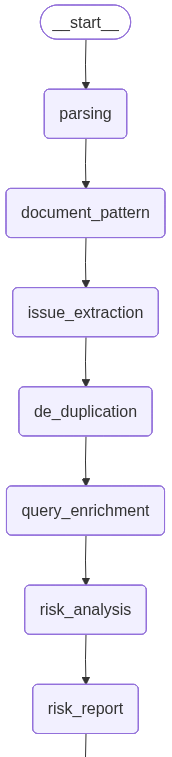
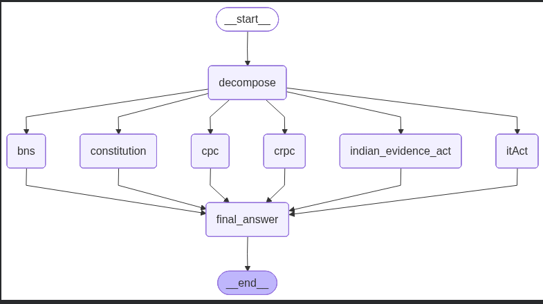

# ⚖️ Legal AI Assistant (Indian Law Focused)

An **AI-powered Legal Document Analysis Assistant** designed to analyze Indian legal documents, identify potential legal issues, and answer user queries using **Retrieval-Augmented Generation (RAG)** and **agentic AI workflows**.

> ⚠️ **Disclaimer**  
> This project does **not provide legal advice**. It only highlights potential legal issues and extracts information for educational and analytical purposes.

---

## 🚀 Features

- 📄 Upload and analyze legal documents (PDF / Text)
- 🔍 Automatic identification of **potential legal issues**
- 🧠 Agent-based reasoning using **LangGraph**
- 📚 Context-aware question answering using **RAG**
- 🇮🇳 Optimized for **Indian legal documents**
- 🧾 Structured AI outputs using **Pydantic models**
- ⚡ High-performance backend built with **FastAPI**
- 🖥️ Interactive frontend built with **Streamlit**
- 🗂️ Vector-based document retrieval using **Chroma DB**

---
## 🏗️ System Architecture

The Legal AI Assistant is designed using a **modular, agent-based architecture** to handle legal queries and document analysis in a structured and explainable manner.

---

### 1️⃣ User Legal Query Processing

When a user submits a legal query, the system follows these steps:

1. **Query Decomposition**
   - The user query is decomposed into multiple **sub-queries** to handle complex legal questions more effectively.

2. **Document Identification**
   - Each sub-query is analyzed to identify the relevant Indian legal document, such as:
     - Bharatiya Nyaya Sanhita (BNS)
     - Code of Civil Procedure (CPC)
     - Code of Criminal Procedure (CrPC)
     - Information Technology Act
     - Indian Evidence Act
     - Constitution of India

3. **Context Retrieval**
   - For each sub-query, relevant legal documents are retrieved from **vector databases** using semantic similarity search.

4. **Final Answer Generation**
   - All retrieved contexts are passed to a **Final Answer Node**, which synthesizes a coherent and structured response.
   - The final answer is generated **strictly based on the retrieved documents**, without adding external assumptions or legal advice.

---

### 2️⃣ Document Issue Analysis

This workflow is triggered when a user uploads a legal document for analysis.  
The system follows a **multi-stage, agent-driven pipeline** to ensure accurate, non-redundant, and explainable issue detection.

1. **Document Ingestion**
   - The user uploads a legal document (PDF or DOC format).
   - Text content is extracted from the document for further processing.

2. **Text Chunking**
   - The extracted text is divided into smaller, semantically meaningful chunks.
   - Chunking enables granular analysis and improves issue detection accuracy.

3. **Document Pattern Identification**
   - The system identifies the **document pattern/type** (e.g., contract, agreement, notice, legal pleading).
   - This contextual understanding guides downstream issue extraction.

4. **Chunk-wise Issue Extraction**
   - Each chunk is analyzed independently to identify **potential legal issues, ambiguities, or risky clauses**.
   - Issues are detected in a **neutral, descriptive manner** without legal conclusions or advice.

5. **Issue De-duplication**
   - Extracted issues from all chunks are compared semantically.
   - Duplicate or overlapping issues arising from different chunks are filtered out to avoid repetition.

6. **Issue Enrichment**
   - Each unique issue is transformed into a **user-style legal query**.
   - This enrichment allows the system to reason about each issue using the same strategy as direct user queries.

7. **Risk Analysis via RAG Strategy**
   - For every enriched issue query:
     - Relevant legal documents are retrieved from vector databases.
     - Context-aware reasoning is performed using the same retrieval and answer-generation pipeline as user queries.
   - A risk assessment is generated based strictly on retrieved legal context.

8. **Structured Issue Response Generation**
   - For each issue, a structured response is generated in the following format:

   ```python
   class FinalAnswer(BaseModel):
       legal_explanation: str
       overall_risk_level: str
       affected_parties: List[str]


## 🧩 Agent Graph Workflow

The following diagram illustrates the **LangGraph-based agent workflow** used in the Legal AI Assistant.  
It shows how different nodes interact to process user queries and perform document issue analysis.

<p align="center">
  
</p>

<p align="center">
  
</p>

**Key Nodes in the Graph:**
- **Query Decomposition Node** – Breaks complex legal queries into sub-queries
- **Document Identification Node** – Maps queries to relevant Indian legal acts
- **Retriever Node** – Fetches relevant context from vector databases
- **Reasoning Node** – Performs structured reasoning based on retrieved context
- **Final Answer Node** – Generates the final structured response


## 👨‍💻 Credits

**Himanshu Kansal**  
Backend Developer | AI & Legal-Tech Enthusiast  

Architected and implemented an end-to-end Legal AI Assistant featuring:
- Agentic AI workflows with LangGraph  
- Context-aware legal reasoning using RAG  
- Scalable FastAPI backend  
- Interactive Streamlit interface  

---

